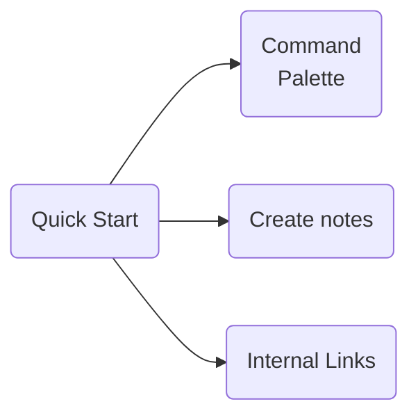
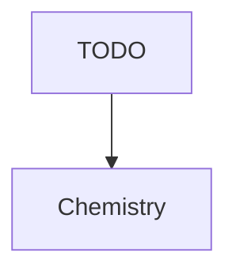
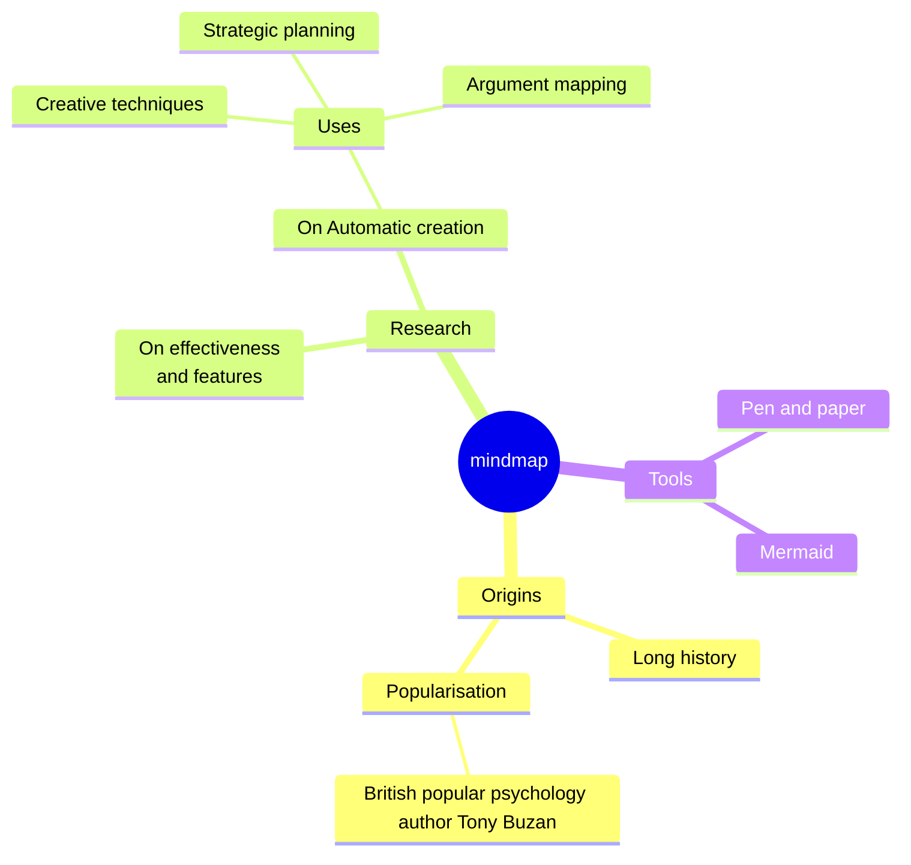

# ✅ Чек-лист для 1:1 (раз в 2 недели, 30 минут)

## 🧠 Подготовка (до встречи)
- [ ] Назначена дата и время встречи
- [ ] Запрошена повестка у сотрудника (через сообщение/форму)
- [ ] Просмотрены заметки с предыдущей встречи
- [ ] Обновлены данные по текущим задачам и инициативам
- [ ] Подготовлены 1–2 вопроса по развитию/сотрудничеству/морали

---

## ⏱️ Структура встречи (30 минут)

### 1. Чек-ин и настроение (3–5 минут)
- [ ] Как у тебя дела в целом?
- [ ] Что из последних событий было важным/необычным?
- [ ] Уровень энергии, стресс, настроение?

### 2. Обсуждение текущей работы (10–15 минут)
- [ ] Как продвигаются основные задачи?
- [ ] Есть ли сложности, которые мешают прогрессу?
- [ ] Что можно улучшить в процессах или коммуникации?

### 3. Развитие и рост (5–7 минут)
*(обсуждаем поочерёдно — не обязательно каждый раз)*
- [ ] Что тебе интересно развивать в ближайшие месяцы?
- [ ] Есть ли возможность взять что-то новое или попробовать себя в чём-то другом?
- [ ] Чем ты особенно гордишься за последние 2 недели?

### 4. Обратная связь (3–5 минут)
- [ ] Я даю обратную связь (конкретную, конструктивную)
- [ ] Прошу фидбек себе: как я могу лучше поддерживать?
- [ ] Что было полезно/неполезно с моей стороны за это время?

---

## 📝 После встречи
- [ ] Зафиксированы краткие заметки и договорённости
- [ ] Назначены действия (если есть)
- [ ] Добавлены напоминания для следующей встречи
- [ ] (опционально) Поделиться резюме с сотрудником

---

## 💬 Полезные вопросы для ротации

- Что тебе особенно понравилось/раздражало в работе за 2 недели?
- Где ты чувствуешь, что топчешься на месте?
- Что стоит прекратить, начать, продолжить делать?
- Что бы ты улучшил в команде прямо сейчас?
- Есть ли что-то, о чём ты давно хочешь поговорить?

