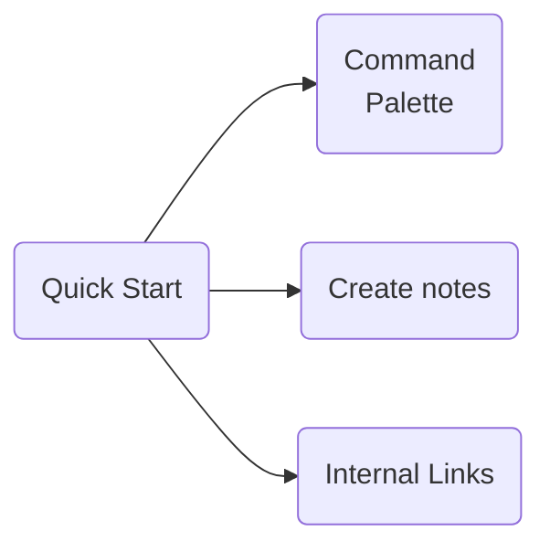
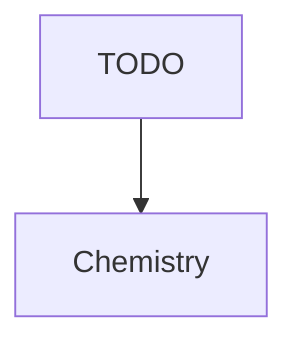
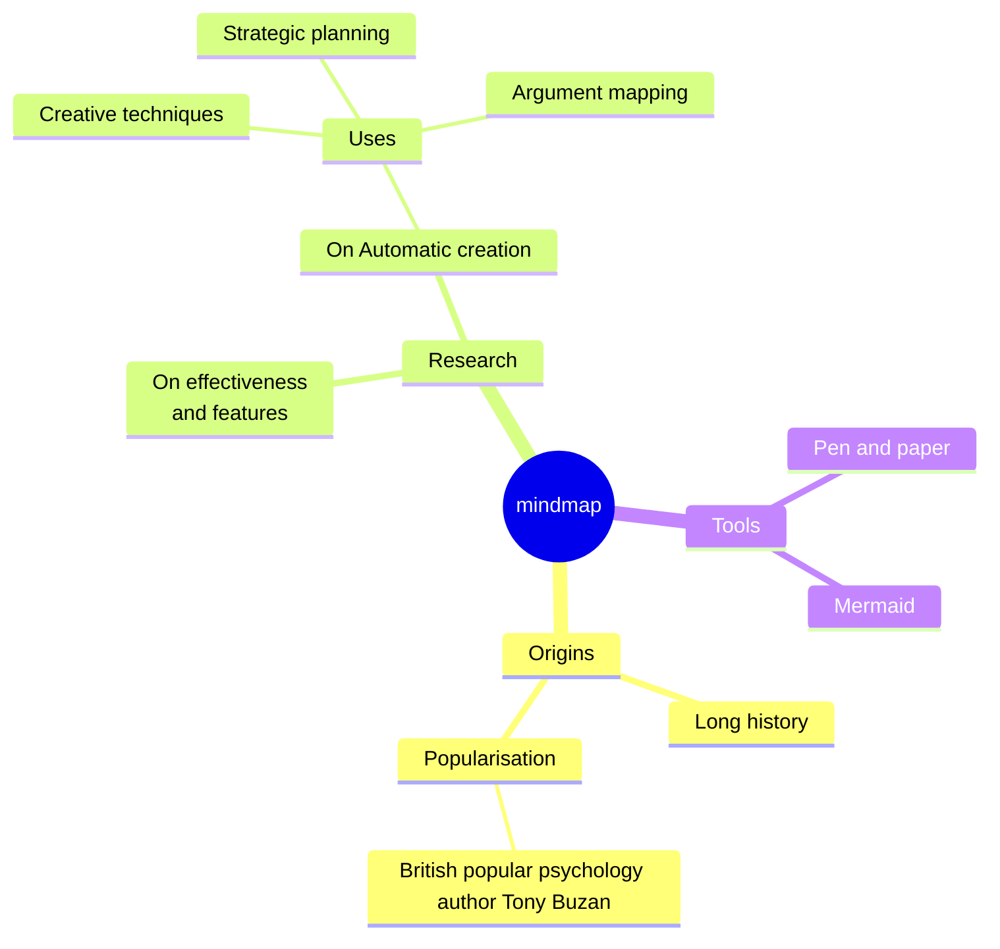

```mermaid
graph LR

%% Nodes
%% =====

QuickStart(Quick Start) --> CmdPalette(Command<BR>Palette)
QuickStart --> CreateNotes("Create notes")
QuickStart --> InternalLinks("Internal Links")

%% Internal links
%% ==============

class CmdPalette internal-link;
class CreateNotes internal-link;
class InternalLinks internal-link;

```

```mermaid
graph TD
TODO --> Chemistry 
class TODO,Chemistry internal-link;
```

```mermaid
mindmap
  root((mindmap))
    Origins
      Long history
      ::icon(fa fa-book)
      Popularisation
        British popular psychology author Tony Buzan
    Research
      On effectiveness<br/>and features
      On Automatic creation
        Uses
            Creative techniques
            Strategic planning
            Argument mapping
    Tools
      Pen and paper
      Mermaid


```
