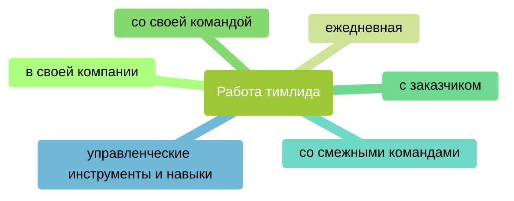

# Основные обязанности тимлида

В этом разделе собраны основные обязанности тимлида. Они могут варьироваться от компании к компании и от проекта к проекту. Поэтому Вы можете использовать его как основу, как отправную точку.

Обсудите со своим непосредственным начальником что будет входить в Вашу зону ответственности, а что не будет. Это позволит Вам сосредоточить свои усилия на действительно важных для компании и проекта вещах и не распыляться на неважные. Изучая их шаг за шагом, находите способы встраивать их в свою работу так, чтобы тратить на них минимум сил, времени и не в ущерб результату.

Это будет увлекательное путешествие. Я даже немного завидую Вам, что Вы сейчас находитесь в его начале и сможете открывать для себя новые идеи и подходы к работе.

## Работа в своей компании

1. Управленческая иерархия
2. Понимание ценностей компании
3. Найм нового сотрудника
    1. Когда и как открываются новые позиции
    2. Анализ задач и требований для новой позиции
    3. Процесс отбора кандидатов
    4. Составление описания вакансии
    5. Подготовка к собеседованию
    6. Проведение собеседования
4. Выход на работу нового сотрудника
    1. Задачи тимлида во время испытательного срока по отношению к новому сотруднику
5. Согласование отпусков
6. Согласование переработок
7. Начисление премий
8. Как и с кем решать возникающие проблемы
    1. Набор и увольнение сотрудников    
    2. Поддержание трудовой дисциплины в команде    
    3. Роли администрации (бухгалтерия, юрист, отдел кадров, HR, офис-менеджер, системный администратор)    
    4. Эскалация 
9. Этика работы
	1. Неэтичное и/или агрессивное поведение (оскорбления, персональные претензии, дискриминация, провокации)
	2. Нарушение целостности конфиденциальной информации (доступ к инфраструктуре, документам)
## Ежедневная работа тимлида

1. Принципы работы с техническими инструментами  
    1. Email
    2. Календарь
    3. Zoom
    4. Jira
    5. Confluence
    6. PowerPoint
    7. Инструменты планирования (SmartSheets, Portfolio Structure)
2. Управленческие ситуации
    1. Что делать, когда не отвечают на письма
    2. Эскалация
    3. Культура переписки
    4. Продвижение изменений к реализации
    5. Действия в случае кризисной ситуации (ситуации, когда есть угроза интересам заказчика)
3. Баланс между работой и отдыхом

## Работа со своей командой

1. Адаптация к роли менеджера
2. Ситуативное лидерство
3. Мотивация. Системный подход по работе с мотивацией
4. Индивидуальный план развития
5. Планирование, организация, реализация, координация, контроль
6. Постановка задач
7. Обратная связь
8. Встречи один на один
9. Решение конфликтов
10. Работа с премиями. Премия как управленческий инструмент

## Работа с заказчиком

1. Работа с заказчиком
2. Метод "5 почему"

## Работа со смежными командами

1. Налаживание коммуникации
2. Достижение договоренностей и следование им
3. Координация совместных действий
4. Поддержка по техническим и организационным вопросам

## Управленческие инструменты и навыки

1. Управление рисками
2. Делегирование
3. Тайм менеджмент
4. Джедайская техника пустого инбокса