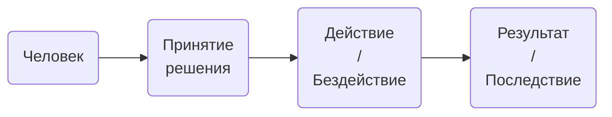

# Что такое ответственность?
## Терминология
Для начала давайте определимся что подразумевают, когда произносят слово "ответственность". Одного единственного определения нет. Поэтому ниже приведены три варианта из разных сфер: философии, юриспруденции и психологии. Найдём в них суть.

**Ответственность** - это субъективная обязанность отвечать за поступки и действия, а также их последствия. Это осознание и готовность признать, что результат, который ты получаешь в ходе твоих поступков и действий, и есть следствие твоих поступков (действий).

**Ответственность** - это определенный уровень негативных последствий для субъекта в случае нарушения им установленных требований. По характеру санкций за совершаемые действия выделяют следующие виды ответственности: юридическую, материальную, моральную, уголовную, административную и др.

**Ответственность** - это личностная характеристика человека, описывающая его способность обстоятельно анализировать ситуацию, заранее прогнозировать последствия (весь комплекс следствий) своих действий или бездействий в данной ситуации и делать выбор формы своих поступков с готовностью принять последствия выбора, как неизбежные свершившиеся факты.

Во всех трёх определениях есть общая цепочка:

## Вопрос про ответственность на собеседовании
Самый простой способ узнать у кандидата на собеседовании ответственный он или нет - это задать вопрос - "<u>От кого зависят результаты твоей работы?</u>"

Если ответ будет - "<u>Только от меня</u>", то человек скорее всего ответственный.

Если же в ответе будут фигурировать коллеги, начальство, стечение обстоятельств, инопланетяне, вспышки на солнце и т.п., то на этого человека невозможно будет положиться. Он не готов брать на себя ответственность.

## Что значит брать на себя ответственность?
1. Думать о последствиях.
2. Обеспечивать нужный результат.
3. Преодолевать трудности, управлять рисками.
4. Своевременно информировать (того, перед кем ответственны), если ситуация выходит из-под контроля
5. При наступлении негативных последствий или отсутствии нужного результата принимать на себя соответствующие санкции.

> Увольняют не за ошибки, а за то, что не извлекают из ошибки уроков.

## За что отвечает руководитель?
За поступки, поведение, результаты работы своей команды, за то, что они говорят и делают для клиентов и коллег.

## Чем отвечает?
Репутацией, своим личным Goodwill'ом (совокупностью доверия к себе, уверенностью в положительном результате, позитивным отношением к себе).