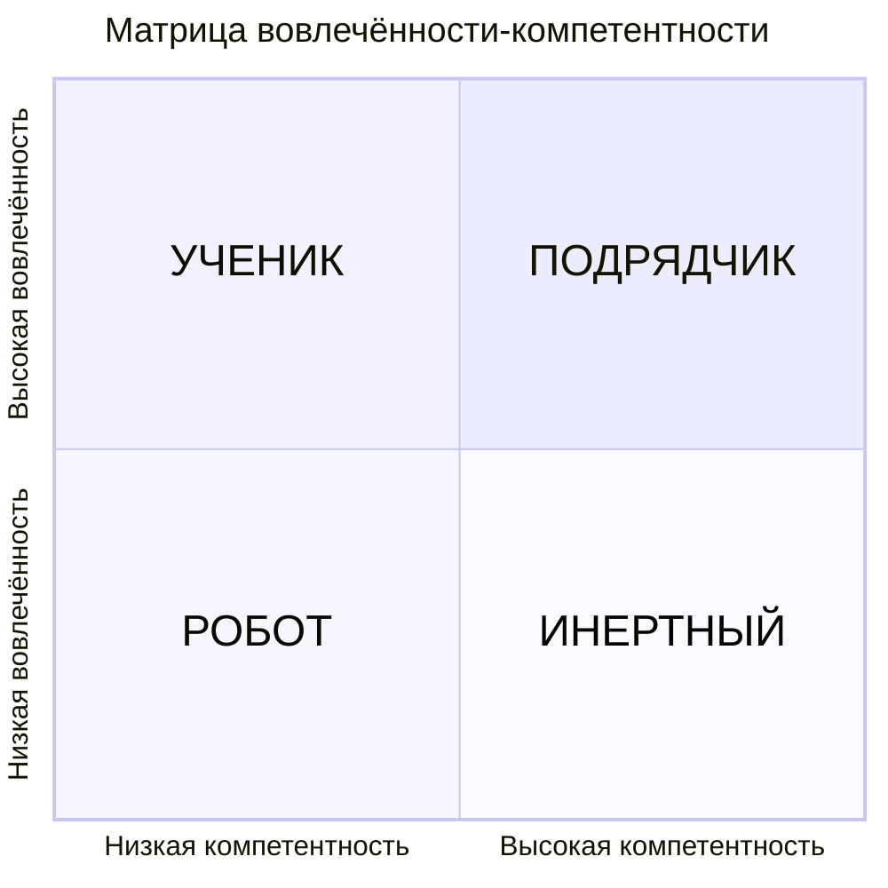

# Как подобрать правильный стиль управления

## Ситуативное лидерство
**Ситуативное лидерство** основано на матрице вовлечённости-компетентности. Пользуясь этой матрицей сотрудников можно поделить на четыре категории по отношению к той или иной задаче или типу задач.

**Очень важно!** Когда пользуетесь этой моделью, помните, что критерии вовлечённости и компетентности **ВСЕГДА** относятся к какой-то конкретной задаче или типу задач. Например, один и тот же человек в текущий момент времени может великолепно выполнять <задачу 1> и хотеть ею заниматься. Тогда к нему нужно применять один стиль управления. По прошествии времени у него может пропасть желание выполнять <задачу 1>. Соответственно, и стиль управления к нему нужно будет подбирать другой. Именно поэтому это и называется **ситуативным лидерством**. Опишу это на примерах ниже.

### "Подрядчик"
Я великолепно умею готовить блинчики. Они всегда у меня получаются вкусные, красивые, в меру прожаренные. А если к ним ещё варенье, сгущёнку или ягоды добавить, то и глаз будет радоваться, и оторваться от них будет очень-очень сложно. Это означает, что мой уровень компетентности в выпекании блинчиков высокий. В тоже самое время я люблю делать блинчики. Предложи мне приготовить их, и я с радостью соглашусь. Это значит, что моя вовлечённость в приготовлении блинов высокая.

Смотрим матрицу. Высокие компетентность и вовлечённость -> попадаем в квадрант, который условно назван "**Подрядчик**".

Т.е. если Вам, как руководителю, нужно обеспечить приготовление блинчиков, то Вы ставите такую задачу мне. Тогда я, как "Подрядчик" в приготовлении блинов, выполню её в самом лучшем виде.

Смотрим дальше.

### "Ученик"
Я НЕ умею готовить драники. Т.е. моя компетентность в их приготовлении - низкая. И я хочу научиться их готовить также вкусно, как у меня получаются блинчики. Т.е. предложи мне научиться готовить драники, глаза у меня загорятся и руки зачешутся. Это означает, что у меня высокая вовлечённость в приготовлении драников.

Снова смотрим матрицу. Низкая компетентность и высокая вовлечённость -> попали в квадрант с условным названием "**Ученик**".

Т.е. если Вам, как руководителю, нужно обеспечить приготовление драников, то Вы можете поставить мне такую задачу. Но на выходе в текущей ситуации результат скорее всего будет неудовлетворительным, т.к. я являюсь "Учеником" в задаче приготовления драников. Чтобы получить от меня вкусные аппетитные дранички, Вам нужно сначала обучить меня технологии их приготовления. Обучать можно лично, через наставника, через курсы и т.п. После обучения мне нужно будет несколько раз нажарить драники под присмотром/помощью/поддержкой кого-то, кто умеет их хорошо делать, чтобы я смог отточить навык. Т.о. для задачи приготовления драников Вы сможете перевести меня из "Ученика" в "Подрядчика". После этого я смогу жарить Вам драники ни чуть не хуже блинчиков.

> Я продолжу также подробно (и, возможно, нудно) расписывать эти примеры только для того, чтобы у Вас сразу отложилось в памяти, что это условное деление сотрудников ни в коем случае не является их ярлыками. Это только показывает комбинацию их уровней вовлечённости и компетентности по отношению к **определённым задачам** или **типам задач**. А Вам, как руководителю, даёт подсказки какой стиль управления выбрать к этому конкретному сотруднику, когда Вы поручаете ему выполнить эту конкретную задачу.

### "Инертный"
Переходим к мачанке. Я умею её готовить очень хорошо. Каждый, кто её попробует, расхваливает как только может. Т.е. компетенция в приготовлении мачанки у меня высокая. Но готовить мне её поднадоело. Глазки не загораются, когда мне предлагают её сделать. Съесть её готов, а вот готовить - не особо. Т.е. вовлечённость в приготовлении мачанки у меня низкая.

Возвращаемся к матрице. Низкая вовлечённость и высокая компетентность -> попадаем к "**Инертному**". Ещё раз напомню, что это условное обозначение по отношению к определённой задаче. Ни в коем случае не ярлык. Всего лишь **подсказка** для Вас как в **данный конкретный момент** Вам работать со мной при **постановке конкретной задачи**.

Т.е. если Вам, как руководителю, нужно обеспечить приготовление мачанки, то Вы можете поставить мне такую задачу. Но, чтобы получить в этом случае от меня хороший результат в приемлемый срок, Вам нужно будет подумать как это сделать, на какой "козе ко мне подъехать", как замотивировать, как проконтролировать. В идеале стоит найти способ как повысить мою вовлечённость в приготовлении мачанки, чтобы перевести меня из "Инертного" в "Подрядчика". Например, напомнить мне, что я совсем недавно научился классно делать драники, которые с мачанкой будут отлично сочетаться. Не хуже, а то и лучше, чем с блинами. И эта идея, которая минуту назад не приходила мне в голову, может мне понравиться. Глазки загорятся, а руки потянуться готовить.

### "Робот"
Долго думал какой кулинарный пример тут привести...

Предположим, что Вам, как руководителю, нужно обеспечить приготовление котлет полуфабрикатов из хлеба и картона. Вы идёте ко мне, как к своему подчинённому, даёте хлеб, картон и ставите задачу готовить из них котлеты. Я смотрю на Вас выпученными глазами. Во-первых, я понятия не имею как из этого готовить. Т.е. обладаю низкой компетенцией в приготовлении котлет из хлеба и картона. Во-вторых, я вообще сомневаюсь, что удастся из этого сделать хоть что-то съедобное. Т.е. вовлечённость у меня тоже низкая.

Что нам говорит матрица? Низкие вовлечённость и компетенции -> попадаем к "**Роботу**".

Т.е. чтобы я наделал таких котлет, Вам нужно выдать мне очень чёткую, понятную инструкцию как эти котлеты делать, которая исключает любую неоднозначность. Да ещё и надсмотрщика ко мне приставить, т.к. желание этим заниматься у меня близко к нулю. В этом случае, Вы сможете получить приемлемый для себя результат.

## Вовлечённость ≠ Лояльность
Добавлю ещё одно замечание. Не путайте лояльность и вовлечённость в этой модели.
[[TODO]] опиши разницу