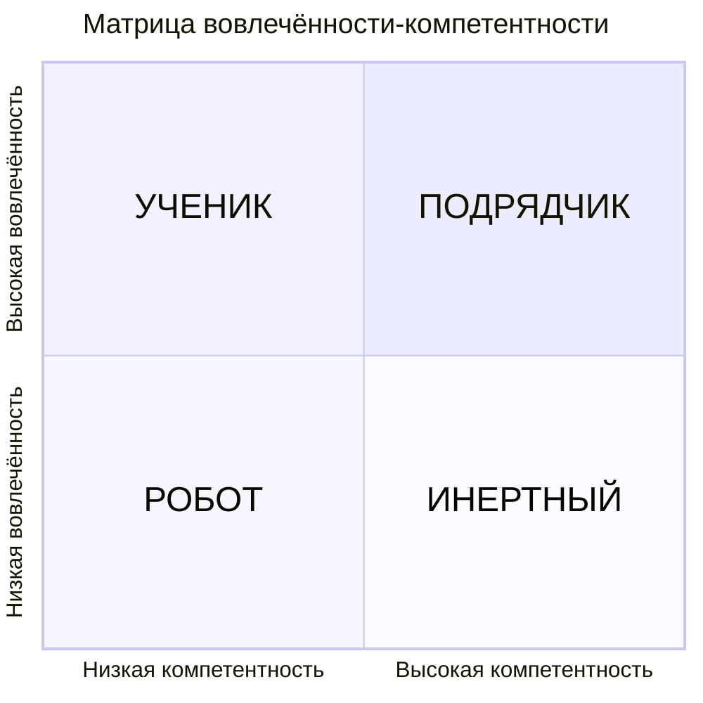

# Как подобрать правильный стиль управления

```mermaid
%%{init: {"quadrantChart": {"quadrantLabelFontSize": 25, "xAxisPosition": 'bottom'}, "themeVariables": {} }}%%
quadrantChart
  title Матрица вовлечённости-компетентности
  x-axis "Низкая компетентность" --> "Высокая компетентность"
  y-axis "Низкая вовлечённость" --> "Высокая вовлечённость"
  quadrant-1 "ПОДРЯДЧИК"
  quadrant-2 "УЧЕНИК"
  quadrant-3 "РОБОТ"
  quadrant-4 "ИНЕРТНЫЙ"
```
