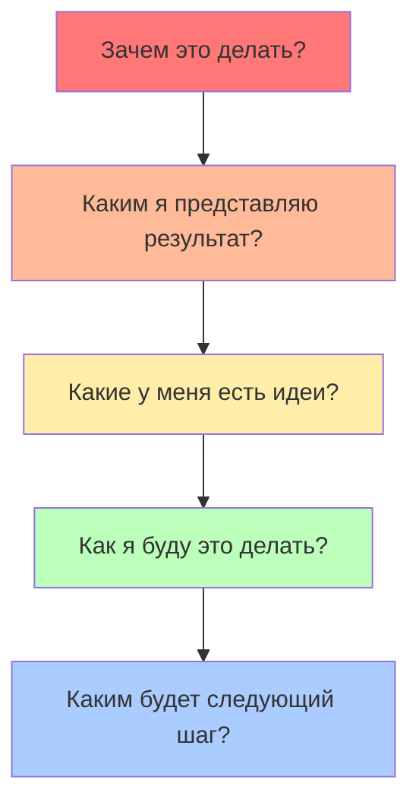

# Метод естественного планирования

Метод естественного планирования - это техника анализа предстоящих задач и проектов, которая помогает найти оптимальный способ их выполнения. В ней используется тот алгоритм, с помощью которого наш мозг обычно принимает решения (именно поэтому такой способ планирования и называется «естественным»). Отклонения от этого алгоритма или пропуск отдельных его этапов могут привести к серьезным просчетам в планировании.

Метод разработан американским специалистом по личной эффективности Дэвидом Алленом, создателем системы GTD (Get Things Done). Он отлично сочетается с любой системой тайм-менеджмента и может использоваться сам по себе. Очень хорошо подходит для:

1. Больших задач, все элементы и нюансы которых трудно удержать в голове.
2. Задач, к которым не понятно как подступиться, с чего начать их делать, к какому результату их нужно довести.

Методика естественного планирования состоит из пяти этапов, которые попеременно задействуют правое и левое полушария мозга:

## Этап 1. Цели и принципы

Прежде чем приступать к любому планированию, следует ответить на вопрос: "**Зачем?**" Зачем вообще нужно все это делать? В чем цель предстоящей деятельности? Я собираюсь это сделать, чтобы… что?

Например:
- Зачем я хочу создать свой сайт?
- Для чего мне нужна эта встреча?
- Я собираюсь записаться на эти курсы, чтобы… что?

Иногда, чтобы выявить настоящую цель, нужно задать вопрос "**Зачем?**" несколько раз.

> Я хочу записаться на эти курсы чтобы… что? Чтобы научиться полиграфическому дизайну. Зачем? Чтобы получать больше заказов. Зачем? Чтобы больше зарабатывать. Зачем? Чтобы лучше обеспечивать себя и свою семью.

Если в конце цепочки находятся ваши жизненные ценности или ваши настоящие желания, то цель выбрана правильно.

От выявления цели зависит очень многое. Например:

- **Мотивация.** Когда мы помним о настоящей цели, то меньше подвержены апатии и прокрастинации.
- **Выбор средств.** Может оказаться, что наша первоначальная идея отнюдь не самая лучшая и достичь цели проще каким-нибудь другим способом. 
- **Расстановка приоритетов.** Мы понимаем, какую роль нужно отвести этому проекту среди других дел.

В некоторых случаях может выясниться, что у предстоящей деятельности вообще нет никакой серьезной цели и от нее лучше бы совсем отказаться. Например, мы запланировали арендовать офис, чтобы «было как у всех», хотя все наши клиенты делают заказы только через интернет, а все сотрудники отлично работают и на дому. Или: мы запланировали прочитать книгу о древних скандинавах, которую нам порекомендовал знакомый, хотя этой темой абсолютно не интересуемся.

Также на этом этапе желательно определить принципы, ценности и стандарты, которых вы собираетесь придерживаться для достижения цели. Например: "Мы будем раскручивать сайт компании, используя только „белые“ способы продвижения".

## Этап 2. Видение результатов

Теперь нужно ответить на вопрос: каким вы видите результат проекта, в случае его успешного завершения? Подумайте:

- Что будет критерием его завершения?
- Что будет критерием качества?
- Как он будет выглядеть? 
- Что вы будете чувствовать, когда все это сделаете?

Попробуйте посмотреть на свой проект так, словно он уже завершен. Например:

- Что конкретно я получу, когда создам сайт? Как он будет выглядеть и работать? 
- О чем я должен договориться на этой встрече?
- Чему я должен научиться на этих курсах? Что я буду знать и уметь?
- Каких результатов мы ожидаем от этой акции? Как будет выглядеть воронка продаж? Сколько мы готовы отдать за привлечение каждого клиента?

После того как мы "увидели" результат, у нас в голове начинает формироваться план предстоящей деятельности.

## Этап 3. Мозговой штурм

На этом этапе нужно собрать все идеи, касающиеся проекта. Поразмышляйте над вопросами:

- Какие мысли возникают у меня в связи с этим проектом?
- Каково положение дел в настоящий момент? Что я хочу изменить?
- Какие детали следует обдумать?
- Какой информацией я обладаю?
- Какую информацию мне необходимо получить? 

Мозговой штурм состоит из двух фаз:

1. **Сбор идей.** Запишите все пришедшие в голову идеи, никаких их не оценивая, не анализируя и не критикуя. Для записи можно использовать обычный лист бумаги или текстовый файл. Также сегодня стало очень популярным проводить мозговой штурм с помощью интеллект-карт, расписывая свои идеи от общего к частному.
2. **Анализ.** Когда все идеи записаны, их можно проанализировать и забраковать то, что явно не подходит. Оставшиеся идеи пригодятся на следующем этапе, для планирования проекта.

Мозговой штурм помогает заполнить пробелы в видении ситуации, найти оригинальные решения и ответить на вопрос "Как именно осуществить задуманное?".

## Этап 4. Организация

На этом этапе нужно составить план достижения цели. Для этого нужно:

- Понять, как найденные во время мозгового штурма идеи "стыкуются" друг с другом. Какие из найденных решений можно использовать, а какие нет?
- Определить компоненты проекта: подпроекты, этапы или промежуточные цели, т.е. сделать декомпозицию.
- Если найденные компоненты требуют последовательного выполнения, разбить проект на этапы.
- Если последовательного выполнения не требуется, следует просто расставить приоритеты (т.е. подумать, с чего начать).

На этом этапе можно использовать любые инструменты планирования: списки действий, организационные диаграммы, графики Ганта и тому подобное. Детализируйте план до нужного вам уровня. Для крупных и сложных проектов план лучше сделать максимально подробным.

## Этап 5. Следующее действие

Завершающий этап в методе естественного планирования - это определение дальнейших действий по проекту (или по каждой из его составляющей). Для начала сформулируйте и запишите самый первый шаг, который приблизит вас к цели. Например:

- Проект: создание сайта. Первый шаг: определить миссию сайта.
- Проект: договориться с инвестором. Первый шаг: сделать прототип продукта для презентации. 
- Проект: пройти курсы флэт-дизайна. Первый шаг: почитать отзывы о разных курсах.

Если предыдущие этапы естественного планирования тщательно проработаны, то с определением первых шагов обычно проблем не возникает. В противном случае нужно еще раз посмотреть на все этапы и выяснить, что именно нуждается в уточнении или доработке.

После определения первого шага начинается реализация проекта. Не забывайте после выполнения каждой задачи по проекту своевременно планировать следующие действия.

## Заключение

Естественное планирование отлично справляется как с крупными проектами, так и небольшими задачами. Вся разница между ними заключаться лишь в степени детализации.

Например, для масштабного проекта (построить дом, основать компанию) желательно тщательно проработать и расписать каждый этап: от этого часто зависит успех всего мероприятия. А для небольших проектов (сходить в магазин, прибраться в гараже, вылечить зуб) достаточно сформулировать ожидаемый результат и определить первоочередной шаг.